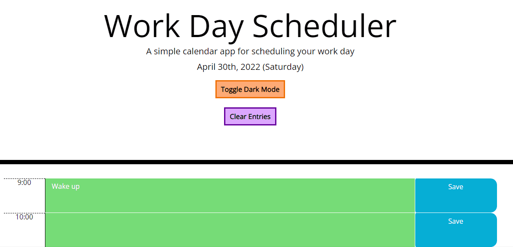

# Day-Planner

A calendar app that allows the user to plan out their work day. 9 hours on this schedule planner, with each hour changing colors to reflect whether that hour has passed, currently happening, or coming up. User is also able to save their inputted tasks for each hour.

Day Planner deployed [here](https://swagnarok630.github.io/Day_Planner/)

## Criteria

* Current day is displayed at the top of the planner when opened
* User is presented with timeblocks for a standard business day
* Timeblocks are color coded to represent past, present, or future
* User may click on any timeblock to input a task or event
* There is a save button for each timeblock so the user may save their tasks/events
  * These items are saved to local storage
* When the page is refreshed, the user's inputted items persist in their respective timeblocks

## Bonus Features

* A button that toggles a dark/light mode for the planner
  * 
* A button to clear values and input so the user doesn't have to manually override timeblocks
  * 

## Notes
While the planner is functioning to the criteria with no major issues, there are a few items that could be addressed in the future
* When hovering over the save button in light mode, the text turns black, however hovering over it in dark mode does nothing
  * If possible, would like to the text to change color in dark mode as it does in light mode
